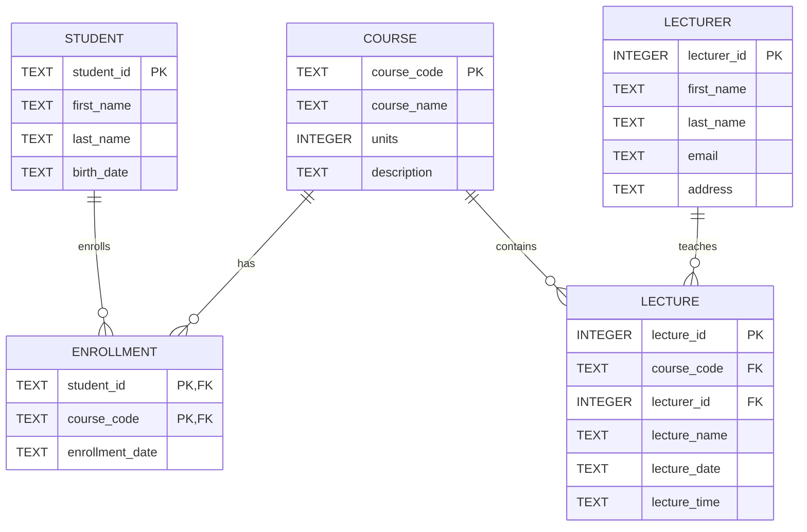

# Activity 4. University Database Project (raw Python `sqlite3`)

This project revises the supplied ER diagram and implements the database using Python's built-in `sqlite3` module.

## Updated ER model

The diagram is created using `mermaid` notation.



### Cardinalities

- One student can have zero or many enrollments
- One course can have zero or many enrollments
- `Enrollment` implements the many-to-many relationship between `Student` and `Course`
- One course can contain zero or many lectures
- One lecturer can teach zero or many lectures
- Each lecture belongs to exactly one course and is taught by exactly one lecturer in this model

## Project structure

```text
/
├── db.py        # connection configuration
├── schema.py    # tables, keys, constraints, and indexes
├── seed.py      # sample data
├── queries.py   # assignment SQL queries
├── main.py      # application entry point
├── README.md
└── university.db  # created/populated when main.py is run
```

## Running the project

No third-party packages are required.

```bash
python main.py
```

`main.py` recreates the schema, inserts the sample data, runs both required queries, and prints their results.

## Output example

```text
1. Students registered in each course
------------------------------------------------------------
COMP101  Introduction to Programming      4
DATA201  Database Systems                 4
NET202   Computer Networks                2
WEB203   Web Development                  2

2. Students enrolled in more than one course
------------------------------------------------------------
S001   Alice Johnson                2 courses
S003   Chloe Wilson                 2 courses
S004   Daniel Kim                   3 courses
```