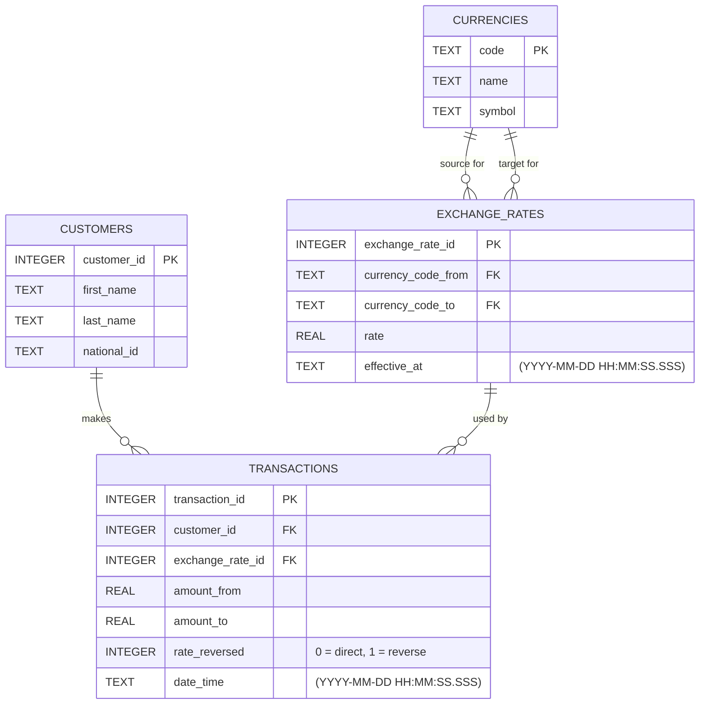

Activity 5. Currency Exchange Project

Task:
> Design ER diagram and develop a database for the money exchange project (with at least three entities and OOP style). In a README file, clearly describe how many tables you have created and justify why each table is necessary.

Project scope:
> The Money Exchange System should allow a exchange business to manage customers, currencies, exchange rates, and currency exchange transactions

## ER model



## Tables Description

The database contains 4 tables: `CUSTOMERS`, `CURRENCIES`, `EXCHANGE_RATES`, and `TRANSACTIONS`.

The `CUSTOMERS` table stores information about people who use the exchange service.  This table is necessary because the business needs to know who makes each exchange transaction. 

The `CURRENCIES` table stores the currencies supported by the exchange business, such as NZD, USD, EUR, and GBP. It contains information such as the currency code, name, and symbol.

This table is necessary because the system needs a single place to store information about each currency.

The `EXCHANGE_RATES` table stores the exchange rate between two currencies. Each record identifies the source currency, the target currency, and the rate used to convert one currency into another.

This table is necessary because exchange rates are an important part of every currency exchange. Storing them separately allows the system to manage different currency pairs and keep a record of the rates used by the business.

The `TRANSACTIONS` table stores each currency exchange made by a customer. It connects a customer with the exchange rate used for the transaction and stores the exchanged amount.

This table is necessary because the business needs to keep a history of completed exchanges. It allows the system to see which customer made a transaction, which currencies and exchange rate were involved, and how much money was exchanged.

## Running the project

No third-party packages are required.

```bash
python main.py
```

> Note: the project is shipped with pre-seeded ready for use database.

## Execution example

```text
% python main.py

1. Exchange currency
2. Remove transaction
3. Show all data
4. Add customer
5. Remove customer
6. Add currency
7. Remove currency
8. Add exchange rate
9. Remove exchange rate
0. Exit

Choose: 3

Customers:
Customer(customer_id=1, first_name='John', last_name='Smith', national_id='NZ123456')
Customer(customer_id=2, first_name='Maria', last_name='Brown', national_id='NZ234567')
Customer(customer_id=3, first_name='Peter', last_name='Wilson', national_id='NZ345678')

Currencies:
Currency(code='AUD', name='Australian Dollar', symbol='$')
Currency(code='EUR', name='Euro', symbol='€')
Currency(code='GBP', name='Pound Sterling', symbol='£')
Currency(code='NZD', name='New Zealand Dollar', symbol='$')
Currency(code='USD', name='US Dollar', symbol='$')

Exchange rates:
ExchangeRate(exchange_rate_id=6, currency_code_from='GBP', currency_code_to='USD', rate=1.35, effective_at='2026-08-17 09:30:00.000')
ExchangeRate(exchange_rate_id=5, currency_code_from='NZD', currency_code_to='AUD', rate=0.91, effective_at='2026-08-17 09:30:00.000')
ExchangeRate(exchange_rate_id=4, currency_code_from='NZD', currency_code_to='USD', rate=0.59, effective_at='2026-08-17 09:30:00.000')
ExchangeRate(exchange_rate_id=3, currency_code_from='EUR', currency_code_to='USD', rate=1.17, effective_at='2026-08-17 09:00:00.000')
ExchangeRate(exchange_rate_id=2, currency_code_from='EUR', currency_code_to='USD', rate=1.16, effective_at='2026-08-16 09:00:00.000')
ExchangeRate(exchange_rate_id=1, currency_code_from='EUR', currency_code_to='USD', rate=1.15, effective_at='2026-08-15 09:00:00.000')

Transactions:
Transaction(transaction_id=1, customer_id=1, exchange_rate_id=3, currency_code_from='EUR', currency_code_to='USD', amount_from=100.0, amount_to=117.0, rate_used=1.17, date_time='2026-08-17 18:52:27.265')
Transaction(transaction_id=2, customer_id=2, exchange_rate_id=5, currency_code_from='NZD', currency_code_to='AUD', amount_from=250.0, amount_to=227.5, rate_used=0.91, date_time='2026-08-17 18:52:27.265')
Transaction(transaction_id=3, customer_id=3, exchange_rate_id=6, currency_code_from='GBP', currency_code_to='USD', amount_from=75.0, amount_to=101.25, rate_used=1.35, date_time='2026-08-17 18:52:27.265')
Transaction(transaction_id=4, customer_id=1, exchange_rate_id=3, currency_code_from='USD', currency_code_to='EUR', amount_from=200.0, amount_to=170.94, rate_used=0.8547008547008548, date_time='2026-08-17 18:52:27.265')
Transaction(transaction_id=5, customer_id=1, exchange_rate_id=5, currency_code_from='NZD', currency_code_to='AUD', amount_from=123.0, amount_to=111.93, rate_used=0.91, date_time='2026-08-17 19:09:27.959')
Transaction(transaction_id=6, customer_id=1, exchange_rate_id=5, currency_code_from='AUD', currency_code_to='NZD', amount_from=500.0, amount_to=549.45, rate_used=1.0989010989010988, date_time='2026-08-17 19:22:09.267')

1. Exchange currency
2. Remove transaction
3. Show all data
4. Add customer
5. Remove customer
6. Add currency
7. Remove currency
8. Add exchange rate
9. Remove exchange rate
0. Exit

Choose: 1
Customer ID: 3
From: EUR
To: USD
Amount: 300
300.00 EUR -> 351.00 USD
Rate used: 1.17000000
```

## Limitations

Only direct and reverse conversions are supported at the moment.

Conversions through an intermediate currency are not implemented.