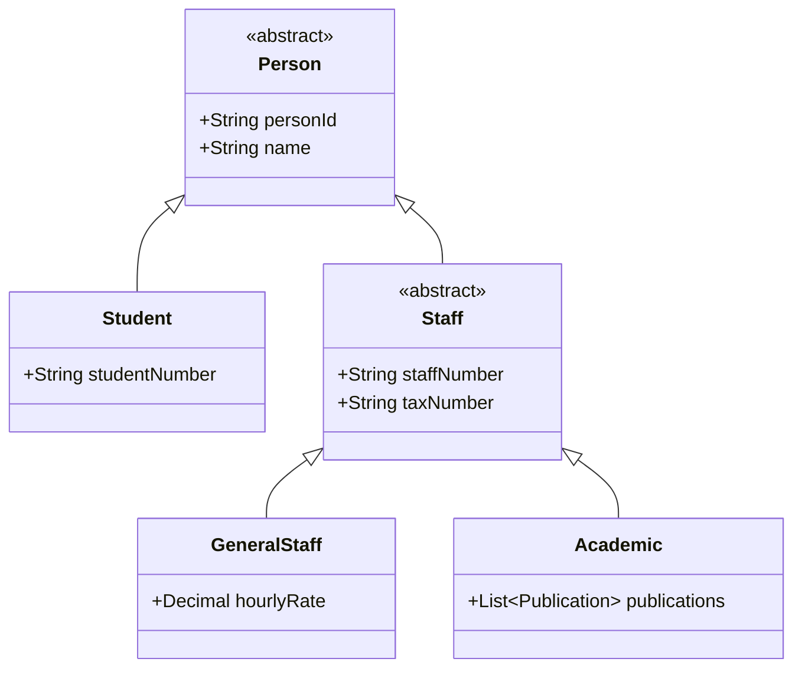

### Description

This project implements a class hierarchy for the following diagram

```mermaid
classDiagram
    direction TB

    class Person {
        <<abstract>>
        +String personId
        +String name
    }

    class Student {
        +String studentNumber
    }

    class Staff {
        <<abstract>>
        +String staffNumber
        +String taxNumber
    }

    class GeneralStaff {
        +Decimal hourlyRate
    }

    class Academic {
        +List~Publication~ publications
    }

    Person <|-- Student
    Person <|-- Staff
    Staff <|-- GeneralStaff
    Staff <|-- Academic
```
